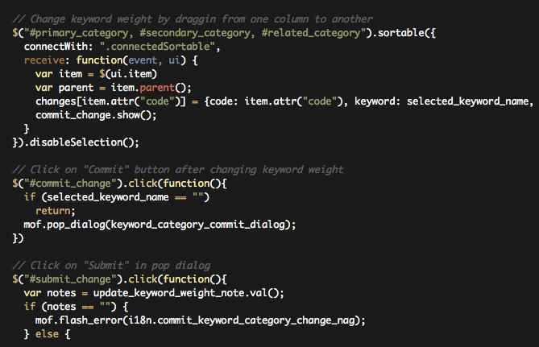

!SLIDE link
<h1>Intro to Backbone JS</h1>
Andrew Kim & Tri Vuong

!SLIDE
<h1 class="slide_title">Back...what?</h1>
<ul>
<li>emerging Javascript framework</li>
<li>Javascript front-end heavy applications</li>
<li>used by major applications (LinkedIn, Basecamp, Foursquare, Pandora, Flow etc)</li>
</ul>

!SLIDE
<h1 class="slide_title">Current problems</h1>

!SLIDE
<h1 class="slide_title">Current problems</h1>

<h3>Spaghetti code</h3>